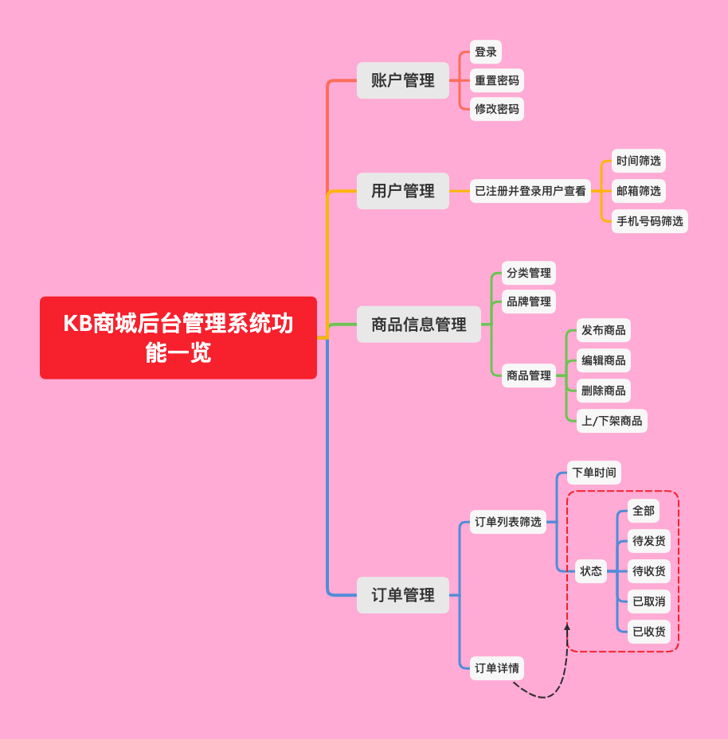
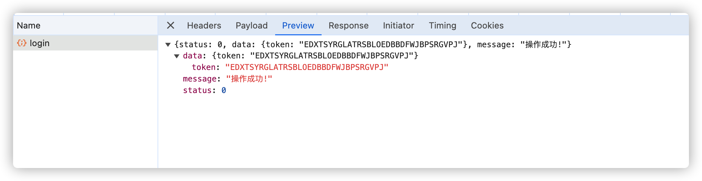
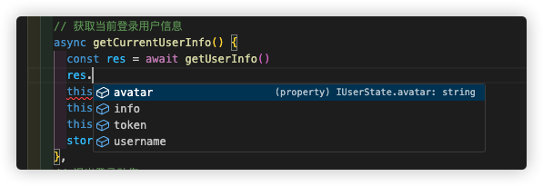

### 项目介绍

#### 项目目录结构介绍
```shell
├── assets: 项目资源文件，用于提供给readme.md说明文档的图片资源
├── build: 自定义的nodejs项目打包配置目录，包括打包所需的静态化配置，并植入到windows对象中
│  ├── script: 项目打包生成待植入到winsows对象中的脚本动作，由build动作自动触发的
│  └── vite: 主要用来提供vite相关的服务
│    └── plugin: vite所需的插件定义目录
├── mock: 接口mock测试的目录定义
├── public: 站点静态化资源定义目录
├── src: 项目代码与资源相关目录
│  ├── api: 接口API定义
│  ├── assets: 项目资源文件
│  ├── components: 全局公共组件目录
│  ├── config: 项目具体配置文件
│  ├── directives: 项目指令
│  ├── enums: 统一的美剧
│  ├── hooks: 项目自定义use-*方法目录集合
│  ├── layout: 项目公共的布局组件
│  ├── plugins: 项目公共的插件
│  ├── router: 项目路由清单
│  ├── settings: 项目设置相关
│  ├── store: pinia的全局store管理器
│  ├── styles: 项目中的样式
│  ├── utils: 统一的工具目录
│  └── views: 具体各个页面
└── types: ts类型定义说明文档，用以辅助项目编码过程中的编码提示目的
```

#### 项目三方依赖库一览
> 这里罗列了关于项目过程中的三方依赖库：
1. `date-fns`: 日期处理工具库，[官网描述与使用](https://date-fns.org/)
2. `esno`: 是一个用于在 Node.js 中执行 ES 模块的工具，它允许你在 Node.js 中直接运行 ECMAScript 模块，而无需使用 CommonJS 的 require() 语法

#### 项目vite插件一览
1. `unplugin-vue-components`: 实现组件的按需导入，具体见[官网描述](https://www.npmjs.com/package/unplugin-vue-components#unplugin-vue-components);
2. `@vitejs/plugin-vue`: vue使用的必须插件，用于将vue文件进行转换，具体见[官网描述](https://github.com/vitejs/vite-plugin-vue)
3. `@vitejs/plugin-vue-jsx`: vue中使用jsx所需的插件，具体见[官网描述](https://github.com/vitejs/vite-plugin-vue/tree/main/packages/plugin-vue-jsx);
4. `vite-plugin-html`: 用于构建时处理html文件，允许在 HTML 文件中使用 Vite 特定的功能，比如自动注入资源、处理模板等，具体见[官网描述](https://github.com/anncwb/vite-plugin-html);
5. `vite-plugin-compression`: 用于构建时配置打包压缩设置，具体见[官网描述](https://github.com/anncwb/vite-plugin-compression);
6. `vite-plugin-mock`: 提供本地和生产模拟服务，并同时支持本地环境和生产环境，`Connect`服务中间件在本地使用，`mockjs`在生产环境中使用，这里需要 :warning: 版本信息的不同的对应使用，具体见[官网描述](https://github.com/vbenjs/vite-plugin-mock)

#### 项目postcss插件一览

#### 项目配置一览
> 项目中使用到不少配置库以及对应库的配置文件，下面将一一列出来：

##### dotenv
> 主要用来根据当前的node环境加载对应的`.env.*`配置文件，实现不同环境不同的配置变量的目的！
> 根据vite官方的描述，在`.env.*`文件中的环境变量，任何以`VITE_`开头的变量将会在`import.meta.env.*`直接访问到，如[官网描述](https://cn.vitejs.dev/guide/env-and-mode.html)
> 项目根据实际情况，主要提供了 :point_down: 3个`.env.*`环境变量配置文件
1. `.env`: 所有情况下都会加载
2. `.env.development`: 开发环境下加载的配置
3. `.env.production`: 生产环境下加载的配置

:star2: 而在对应的环境变量中所提供的变量清单如下所示：

| 变量名称 | 描述 |
|---|:---|
| PORT | 程序运行端口号 |
| GLOB_APP_TITLE | 站点标题 |
| GLOB_APP_SHORT_NAME | 站点短标题 |
| GLOB_PROD_MOCK | 是否开启MOCK |
| PUBLIC_PATH | 网站根目录 |
| USE_MOCK | 是否开启mock |
| BASE_URL | 网站前缀，也就是二级或者N级目录 |
| DROP_CONSOLE | 是否移除console输出 |
| GLOP_API_URL | API接口地址 |
| GLOB_UPLOAD_URL | 图片上传地址 |
| GLOB_IMG_URL | 图片前缀地址 |
| GLOB_API_URL_PREFIX | 接口地址前缀 |
| PROXY | 跨域代理 |
| BUILD_COMPRESS | 是否开启gzip或者brotli压缩 |
| BUILD_COMPRESS_DELETE_ORIGIN_FILE | 使用压缩时是否删除原是文件 |

### 项目过程文档记录
> :point_down: 将项目过程中所遇到的问题一一记录起来，方便后续浏览以及查找问题：

#### 项目整体功能清单
> 项目基本功能一览


:point_right: 通过借助于*vscode-tree-language*这个vscode插件，将项目中的目录给生成出来，并结合`@structure-codes/cli`，通过全局安装的命令来自动生成当前项目目录中的目录，并加以二次编辑形成当前目录说明文档！

#### vite.config.ts配置文件
> 一切从应用程序配置文件入手，通过自定义`build`动作，将原本单一入口的`vite.config.ts`调整自定义按照模块来进行划分的配置

### 关于项目的图标
> 项目中采用`xicons`图标库作为整体项目的图标，使用时，可借助于[官方xicons站点](https://www.xicons.org/#/)进行具体的查询操作，然后在项目中通过 :point_down: 的方式来使用
```typescript
	import { SettingOutlined } from '@vicons/antd'
```
:star: 上述的`SettingOutlined`来源于[官方xicons站点](https://www.xicons.org/#/)上的查询操作！

### 知识查漏补缺
> 在项目coding过程中，由于是初次接触`ts`以及`vue3+`，因此这里将coding过程中未遇见过的相关知识给记录出来，以便于自己后续查阅

#### 仅导入类型而非完整对象: import type
> 在ts中提供了这样的一种语法：`import type`，在 TypeScript 中导入类型而不导入具体的值或对象。这个语法的主要作用是在编译时进行类型检查和静态分析，而不会在运行时添加额外的代码，具体见[官方描述](https://www.typescriptlang.org/docs/handbook/2/modules.html#import-type)

#### vite中的别名配置: resolve
> `vite.resolve`路径别名允许你在你的代码中使用简短的路径来引用模块或文件，而不需要使用长长的相对路径或绝对路径
```typescript
export default {
  resolve: {
      alias: [
        {
          find: /\/#\//,
          replacement: pathResolve('types') + '/',
        },
        {
          find: '@',
          replacement: pathResolve('src') + '/',
        },
      ],
      //选项用于配置模块 deduplication（去重）。这意味着当多个模块引入了同一个模块时，Vite 将只保留一份副本，以减少打包后代码的大小
      dedupe: ['vue'],
    }
}
```
:u6709: 上述这样子的一段代码，主要有两个别名替换操作：
1. `/#/`: 当代码中的路径匹配到 `/#/` 时，将被替换为 `types` 目录的绝对路径。
2. `@`: 当代码中的路径匹配到 `@` 时，将被替换为 `src` 目录的绝对路径。
比如有项目中的代码使用到：
```typescript
  import type { DynamicProps } from '/#/utils';
```

#### 自定义类型说明文件: types/global.d.ts
> 在项目coding过程中，难免需要使用到自定义的对象，为了让ide在编码的过程中能够识别到我们自定义的对象，需要定义对应的类型说明文档，这里以`types/global.d.ts`为例，在上述中，我们有使用到
```typescript
// 缓存的项目的版本描述信息
const __APP_INFO__ = {
  pkg: { dependencies, devDependencies, name, version },
  lastBuildTime: format(new Date(), 'yyyy-MM-dd HH:mm:ss'),
};
```
这里我们需要让这个`__APP_INFO__`能够被ide编译器所识别，因此需要对应的在`types/global.d.ts`中将其声明出来：
```typescript
declare global {
  const __APP_INFO__: {
    pkg: {
      name: string;
      version: string;
      dependencies: Recordable<string>;
      devDependencies: Recordable<string>;
    };
    lastBuildTime: string;
  };
  // 以下省略一系列代码
}
```
:point_right: 而这里的`types/global.d.ts`文件，我们已经在对应的`tsconfig.json`中已经声明出来了！

> 在 `TypeScript` 中，类型声明文件（Type Declaration Files）有一个 `.d.ts` 的文件扩展名，用于提供对已有 `JavaScript` 代码的类型信息。这对于在 `TypeScript` 项目中使用第三方 `JavaScript` 库非常有用，因为 `TypeScript` 是一种静态类型语言，需要在编译时了解变量、函数和对象的类型信息，使用 `declare` 关键字告诉 TypeScript 这些实体已经存在，但是不在当前文件中实现，而关于`declare`关键词的目的主要有：
1. 类型声明： 声明变量、函数、类等的类型而不进行实现。
2. 全局变量声明： 声明全局变量的存在，以便在 TypeScript 中使用这些全局变量而不会引发编译错误。
3. 模块声明： 声明模块或命名空间的存在，以便在当前文件或其它文件中使用。

:trollface: 这里所提及到的全局变量，并非意味着只要定义在`global.d.ts`中的都是全局的， :point_right: 关于是否定义的全局变量取决于`declare`语句出现的上下文：
+. 如果`declare`出现在模块内部(一个文件中包含顶层的`import`或者`export`)，则声明的类型或者值就会被视为模块的一部分，需要通过导入的方式来访问到，也就是模块变量；
+. 如果`declare`出现在模块的外部(没有被`import`或者`export`包裹)，则声明的类型或者值就会被视为全局可见，无需显示导入即可直接在项目的任何地方访问与使用。

:confused: `declare global {...}`，这个语法结构在`TypeScript`中扩展全局作用域类型，通过这个语法，可以往添加新的全局变量、类型、接口等，无需在整个项目中导入即可直接使用！ :warning: 但是也需要谨慎使用全局变量，因为
它可以修改全局作用域，可能因此而导致命名冲突和其他意外的行为！！

#### 组件自动导入：unplugin-vue-components
> 通过借助于`unplugin-vue-components`三方库，可实现将一些UI库中的组件给自动导入，且免在项目代码中显示使用`import`语法来导入对应的组件
```typescript
  // build/vite/plugin/index.ts
import Components from 'unplugin-vue-components/vite';
import { NaiveUiResolver } from 'unplugin-vue-components/resolvers';
  {
    // 按需引入NaiveUi且自动创建组件声明
    Components({
      dts: true,
      resolvers: [NaiveUiResolver()],
    })
  }
```
:star2: 使用了上述的插件配置之后，将会自动地在项目的根目录中生成一`components.d.ts`文件，只要在项目中使用到的关于UI库的组件，则将会被自动导入到项目中，无需自行去一一导入，减少编码次数！

#### use*方法自动导入:unplugin-auto-import
> 在实际的编码过程中，只要我们使用的是组合式的编码方式，那么我们需要经常性地需要导入一系列的`use*方法`，写得多了，自然有点繁琐， :confused: 那么是否拥有那么一种方式，能够像`unplugin-vue-components`实现组件的自动导入般来实现`use*`方法的自动导入呢？ :point_right: 答案是肯定的: **unplugin-auto-import**，也是这个组织的库，通过导入该库，可以方便的实现`use*`方法的自动集成，按需导入来使用
```typescript
// vite.config.js
import AutoImport from 'unplugin-auto-import/vite'
export default {
  plugins: [
    // ...此处隐藏其他插件相关代码
    AutoImport({
      dts: true,
      imorts: [
        'vue',
        {
          'naive-ui': [
            'useDialog',
            'useMessage',
            'useNotification',
            'useLoadingBar'
          ]
        }
      ]      
    })
  ]
}
```
:star: 通过 :point_up_2: 的方式，则可以实现`use*`相关的composable方法的自动导入，无需在使用的时候，一个个进行手写，但也有一个需要注意的是，尽量避免滥用！！

#### 打包发布自动集成版本信息: app.config.js?v=xxx
> 为方便在项目中对整体项目运行过程分辨版本信息，通过使用`vite-plugin-html`插件，在构建生成的html文件中集成版本信息`app.config.js`配置文件，而该文件则是通过自定义的构建文件`/build/script/postBuild.ts`来生成的`app.config.js`，通过`esno`三方库，执行自定义的`postBuild.ts`来输出对应的配置文件，实现版本信息文件的输出并自动注入的目的！！

#### 文件目录下的多模块导入: import.meta.glob
> 在实际项目coding过程中，经常性地需要从各个模块中导入，然后对外暴露统一的一个入口模块，实现所有的模块仅由统一的出口模块访问，因此，可借助于`vite`的`import.meta.glob`来实现多个模块的自动导入，减少手动一个个导入，并对外提供API的方式，具体见[官网关于import.meta.glob的使用](https://cn.vitejs.dev/guide/features.html#glob-import-as)
```typescript
  const modules = import.meta.glob<IModuleType>('./**/*.ts', { eager: true });
```

#### 模拟数据接入：Mock
> 在之前的项目中，大都是直接对接的后台服务，基本上所有的功能都是等着后台的功能实现了，才进行前端功能的对接与联调， :confounded: 但是，实际上可以借助于这个`Mock`，采用与后台一致的数据结构协议，自行进行前端站点功能闭环的实现，而不用必须等到后台的服务提供之后，才来进行对接，这样子前后端的开发可以同时并行，而无需等待的情况，而且自己还可以通过`Mock`来实现不同场景下的场景复现，争取覆盖到不同情况下的测试用例，更有甚者，还可以实现自动化测试的目的，无需依赖后端的业务，自行完成测试的流程，具体见[Mock官网描述](https://github.com/nuysoft/Mock/wiki)
>  :point_down: 来介绍下如何引入mockjs基础框架并集成使用(这里以`vite`集成为例)

##### 1. 安装相关的依赖
```shell
  pnpm install mockjs
  pnpm install vite-plugin-mock --save-dev
```

##### 2. 在vite.config.js插件中引入配置文件
```typescript
  import { viteMockServe } from 'vite-plugin-mock'
  export default defineConfig({
    plugins: [
      viteMockServe({
        ignore: /^\_/, // 忽略指定格式文件
        mockPath: 'mock', // 设置模拟.ts文件存储文件夹
        watchFiles: true,
        enable: true // 这里的enable根据实际情况而定
      })
    ]
  })
```
:stars: 关于这里的参数说明，具体见[vite-mock官网描述](https://github.com/vbenjs/vite-plugin-mock?tab=readme-ov-file#options)

##### 3.对于生产环境创建对应的mock处理函数，开发环境用的cnnect来实现的
```typescript
  // mockProdServer.ts
import { createProdMockServer } from 'vite-plugin-mock/client'
// 逐一导入您的mock.ts文件
import user from './user'
export function setupProdMockServer() {
  createProdMockServer([...user])
}
```
:stars: 这里 :u6709: :one: 需要注意的地是，需要在`tsconfig.json`中对应将`moduleResolution`设置为`bundle`，否则将会找不到这个`vite-plugin-mock/client`

##### 4. 编写具体的mock响应
> 这里根据业务模式进行模拟拆分为不同的文件模块来处理对应的mock
```typescript
import Mock from 'mockjs'
import { resultSuccess } from './_util'
import { MockMethod } from 'vite-plugin-mock'

const token = Mock.Random.string('upper', 32, 32)

export default [
  {
    url: '/api/login',
    timeout: 1000,
    method: 'post',
    response: () => {
      return resultSuccess({ token });
    },
  },
] as MockMethod[]

```
:point_down: 是对应的mock结果：


##### 5. 引用上下文环境来辅助编写响应
> :thinking: 这样子的一个问题：`如果我想要像*restful*的方式来编写接口`，那么这个`mock`是否可以满足到呢？
> :disguised_face: 答案是可以的，但是需要将上述第4点的编写方式稍微调整一下，比如我想通过get请求获取一个商品详情信息，一般我们是通过get请求，然后在url链接中拼接参数的方式，如下代码所示：
```typescript
export default [
	{
		url: '/api/product/:id',
    timeout: 1000,
    method: 'get',
		response: ({url}) => {
			// 定义正则表达式来匹配路由参数
      const regex = /\/product\/(.*?)(\?|$)/;
      // 使用正则表达式匹配URL
      const match = url.match(regex);
      if (match) {
        // 获取匹配到的参数值
        const id = match[1];
        // 根据:id的值做相应的处理
        // 这里返回一个空数组作为示例
        return resultSuccess(id);
      } else {
        // 如果未匹配到路由参数，返回错误信息或者其他处理
        return resultFailed('请按照协议来传参');
      }
    }
	}
]
```
:star2: 这里我们通过自定义的正则匹配的方式，正确匹配到传递过来的链接中的信息，然后对应来处理

#### 引入vite客户端类型声明
> 在`vite`的相关项目中，我们会经常看到在ts文件中有如下的一段代码
```typescript
  /// <reference types="vite/client" />
```
:star2: 是一种特殊的指令，用于在 `TypeScript` 文件中引入 `Vite` 客户端类型声明， :point_right: 这意味着我们可以在开发过程中直接使用`vite`提供的全局变量，例如 `import.meta`，用于访问模块元数据，以及一些`Vite`特定的 API。通过引入这个类型声明，`TypeScript` 编译器可以正确地识别和检查这些全局变量的类型，从而提供更好的类型支持和代码提示。

:trollface: 而关于这个`vite/client`的内容，可具体见[vite client官网内容描述](https://github.com/vitejs/vite/blob/main/packages/vite/client.d.ts)

:confounded: 而关于这种语法，其实是`TypeScript`中所提供的关于命名空间的一种使用，就是通过多个一个/多个文件来提供统一的一个命名空间，对外暴露API的方式，具体见[ts关于namespace的描述](https://www.typescriptlang.org/docs/handbook/namespaces.html)

#### 路由导入组件采用@方式
> 在日常的coding过程中，我们通过对vite配置`alias`配置，设置`@`即为`src`目录，即可完成在编码过程中的实现组件的找寻相关动作，但是对于`typescript`来说，它根本不知道什么情况， :confused: 因此， :point_right: 需要提供一个
机制，告诉`typescript`编译器，应该如何寻找，这里以`*.vue`文件为例子，通过定义以下的配置，来告诉`ts`编译器如何找寻
```typescript
declare module '*.vue' {
  import { DefineComponent } from 'vue';
  const Component: DefineComponent<{}, {}, any>;
  export Component;
}
```
:trollface: 在 `TypeScript` 项目中，当导入 `.vue` 文件时，`TypeScript` 默认无法识别 `.vue` 文件的内容，因为 `.vue` 文件不是标准的 `TypeScript` 模块。为了告诉 `TypeScript` 如何处理 `.vue` 文件，你需要添加一个模块声明文件。 :point_right: 声明了一个模块 `*.vue`，并导出了一个变量 `Component`，其类型为 `DefineComponent<{}, {}, any>`。这个声明告诉 `TypeScript` 当导入 `.vue` 文件时，应该将其视为一个 `DefineComponent` 类型的变量，并且这个变量的具体类型由 `Vue` 的 `DefineComponent` 接口定义。 :point_right: 通过这样的声明，`TypeScript` 就能够正确地识别 `.vue` 文件，并为其提供类型检查和智能提示。这也是为什么在你的 IDE 中，通过添加这个模块声明文件后，IDE 能够识别 `.vue` 文件中的内容，包括组件选项、`props`、`methods` 等，并为其提供相应的代码补全和类型检查。

#### 尝试引入postcss
> `postcss`是一个功能强大的CSS处理工具，帮助开发者编写更加高效、易维护的CSS，其工作原理通过Javascript以及其插件来转换CSS， :point_right: 这意味着可以通过编写Javascript来编写自定义的插件处理CSS，实现处理各种功能，比如自动添加前缀、压缩CSS、支持未来的CSS语法等等
> 关于`postcss`的使用步骤，主要 :u6709: 几个步骤，具体可参见[官网关于postcss的使用](https://github.com/postcss/postcss#usage)：
1. 在项目中引入相关的依赖
```shell
	npm install postcss --save-dev
```
2. 创建postcss.config.js，并引入相关的依赖
```shell
	npm install postcss-autoprefixer postcss-nested --save-dev
```
:star2: 在`postcss.config.s`中引入相关的依赖
```javascript
	// postcss.config.js
	module.exports = {
		plugins: [
			require('autoprefixer'),
			require('postcss-nested')
		]
	}
```
:confused: 这里的依赖并非必须的，但是`postcss`真是因为引入的相关的插件，才能够实现*javascript改写css的目的*
3. 插件选择
:trollface: 根据实际情况，选择适合自己项目的相关插件，并通过各个插件所提供的参数，可实现自己的各个目的，例如，`autoprefixer` 插件可以帮助你自动添加 CSS 前缀，`cssnano` 可以压缩 CSS，`postcss-preset-env` 可以让你使用未来的 CSS 语法，关于插件的浏览，具体可通过[官方插件](https://www.postcss.parts/)，找寻到自己所
想要使用的插件，引入到项目中，实现对CSS的干预！！
4. 实例使用
比如 :u6709: :point_down: 一个场景：
:point_right: 我想要将项目中的图片资源小于某个大小的尺寸给合并到一张雪碧图，并同时将相关的使用到的图片资源引入样式调整，这里借助于`postcss-sprites`
```shell
# 安装对应的依赖
	npm install postcss-sprites --save-dev
```
:star2: 在对应的`postcss.config.js`中引入对应的依赖，并同时通过该插件所提供的参数，补充自定义的逻辑
```javascript

	const fs = require('fs');
	const postcssSprites = require('postcss-sprites');
	// postcss.config.js
	module.exports = {
		plugins: [
			// ... 这里隐藏其他postcss插件
			postcssSprites({
				spritePath: './dist/images', // 雪碧图输出路径
      	retina: true, // 是否支持 Retina 屏幕
				filterBy: function(image) {
					// 过滤函数，根据资源大小判断是否需要合并雪碧图
					const stats = fs.statSync(image.path);
					return stats.size < 1024 * 1024; // 小于1MB的资源进行合并
				},
				groupBy: function(image) {
					// 根据文件路径进行分组，确保相同路径的图片合并到同一个雪碧图中
					const dirname = path.dirname(image.path);
					return path.join(dirname, 'sprite');
				},
				hooks: {
					onSaveSpritesheet: function(opts, spritesheet) {
						// 雪碧图保存后的回调函数，更新对应的 CSS 样式
						const cssFilePath = path.join(opts.stylesheetPath, opts.spritePath, opts.spriteName + '.css');
						let cssContent = fs.readFileSync(cssFilePath, 'utf8');

						// 修改 CSS 样式，更新对应的图片路径
						const spritesheetPath = path.join(opts.spritePath, opts.spriteName + '.png');
						cssContent = cssContent.replace(new RegExp(opts.spritePath, 'g'), spritesheetPath);

						fs.writeFileSync(cssFilePath, cssContent);
					}
				}
			})
		]
	}
```

#### 组件库使用过程记录
> 项目所使用的三方ui库为：[naive-ui](https://www.naiveui.com/zh-CN/os-theme)，是一个仅能够在vue3.+以及typescript4.+以上版本，运行在现代浏览器上的UI组件库， :point_down: 将项目过程中的相关使用说明给列举出来，以便于后续自己方便查找。

#### 使用`Array.from()`来创建一个长度为某个数值的数组
> 在`mockjs`来模拟数据的时候，经常需要模拟一个数据列表，手写感觉不现实，编码效率低，可以使用`Array.from()`方法来创建一个包含指定长度的数组，并且可以指定数组中的每个元素的值，因为`Array.from()`会根据传入的可迭代对象或者类似数组对象来创建一个新的数组实例，因此我们可以通过采用 :point_down: 的方式来创建一个数组
```typescript
	const array = Array.from({ length: 20 }, () => undefined);
	console.info(array)
```
:star2: 这里我们创建了一个长度为20的数组，而且成员都是`undefined`的，这样子我们就可以借助`mockjs`的数据随机性来生成一个成员都不一样的数组数据！

##### 全局插件的的使用
> 在实际的编码过程中，难免需要使用到类似于`showLoading`、`showToast`、`showModal`等API，而且想以插件的形式来调用(也就是随时调用)，那么需要进行以下的一个配置，在`naive-ui`中主要是`n-loading-bar-provider`、`n-dialog-provider`、`n-notification-provider`、`n-message-provider`
```vue
	<!-- App.vue -->
	<template>
		<n-loading-bar-provider>
			<n-dialog-provider>
				<n-notification-provider>
					<n-message-provider>
						<RouterView></RouterView>
					</n-message-provider>
				</n-notification-provider>
			</n-dialog-provider>
		</n-loading-bar-provider>
	</template>
```
:stars: 这里通过对全局路由对象进行一个包裹，使得在这个全局上下文中，都可以直接访问到外层节点provider，通过每个组件所提供的composite-api(相关的use*方法)，可实现对组件的直接访问，如下代码所示：
```vue
	<script lang="ts" setup>
		import { useLoadingBar } from 'naive-ui'
		const loadingBar = useLoadingBar()
		loadingBar.start()
	</script>
```
:trollface: 这样子之后，我们便能够直接在所有的组件中通过这个`use*`方法对全局组件的一个直接访问了！！

:confused: 而在以往的项目过程中，有时不单单需要在sfc组件中使用到这功能，像store这种非组件上下文或者是网络请求框架`axios`中需要使用到这个功能， :point_right: 我们有必要将它暴露到全局范围中(通过`window.$loadingBar`)：
```typescript
	import { createDiscreteApi } from 'naive-ui'
	const { message, notification, dialog, loadingBar } = createDiscreteApi([
		'message', 'dialog', 'notification', 'loadingBar'
	], {/*其他参数配置*/})
	//! 并将其挂载到全局window对象中
	window['$message'] = message
	window['$notification'] = notification
	window['$dialog'] = dialog
	window['$loadingBar'] = loadingBar
```
:+1: 上述通过这个`createDiscreteApi()`可直接引用到当前APP上下文中的已经包裹配置过的全局provider组件，实现一个全局直接访问调用的目的！！

##### 关于接口请求是否需要维护类型
> 在编码的过程中，难免需要与后端接口服务进行通讯， :confused: 那么是否需要声明对应的类型，用于描述各个接口的调用呢？ :point_right: 答案是肯定的，虽然单纯的维护这个接口的数据结构会很繁琐，但是这这对我们在进行编码的过程中，对于代码的自动提示以及避免拼写错误，以及提前发现可能存在的代码漏洞有比较大的帮助，因此，建议还是尽量完善好对应的接口类型的声明，项目中由于是基于`axios`来进行发起网络请求的，这边针对`axios`的基础上搭建了一套基础的服务，因此，实际调用方仅需要简单的编写具体对应的业务逻辑接口即可，如下代码所示：
```typescript
	// 获取当前登录用户信息
export function getUserInfo(): Promise<IUserState> {
	return http.request({
		url: '/user/info',
		method: 'GET'
	})
}
```
:star_struck: 这里我们声明了一方法`getUserInfo`，用于获取登录用户的信息，而且我们将其申明为一Promise响应方法，通过这样子定义，在实际该方法的调用方编写时，即可直接获取到响应结果的数据结构，如下图所示:
