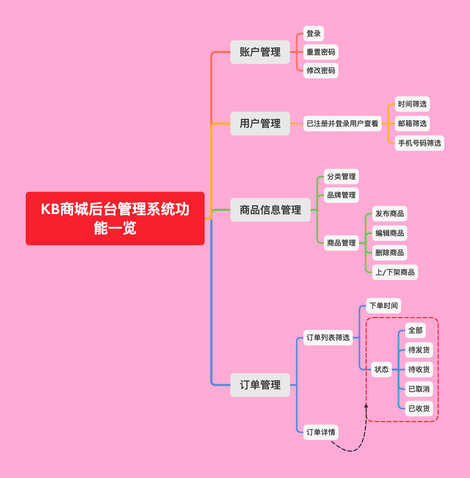
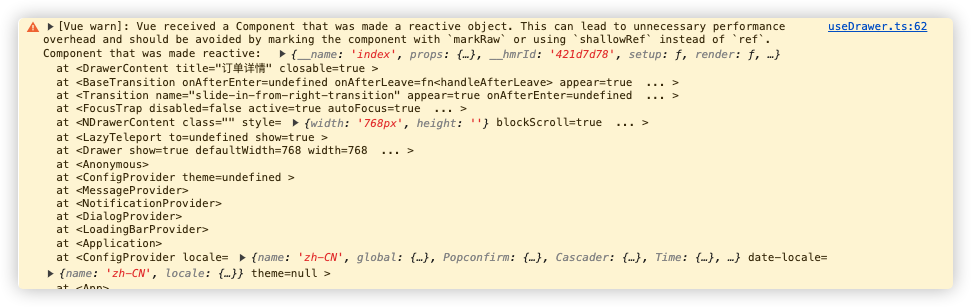

### 项目介绍

#### 项目目录结构介绍
```shell
├── assets: 项目资源文件，用于提供给readme.md说明文档的图片资源
├── build: 自定义的nodejs项目打包配置目录，包括打包所需的静态化配置，并植入到windows对象中
│  ├── script: 项目打包生成待植入到winsows对象中的脚本动作，由build动作自动触发的
│  └── vite: 主要用来提供vite相关的服务
│    └── plugin: vite所需的插件定义目录
├── mock: 接口mock测试的目录定义
├── public: 站点静态化资源定义目录
├── src: 项目代码与资源相关目录
│  ├── api: 接口API定义
│  ├── assets: 项目资源文件
│  ├── components: 全局公共组件目录
│  ├── config: 项目具体配置文件
│  ├── directives: 项目指令
│  ├── enums: 统一的枚举
│  ├── hooks: 项目自定义use-*方法目录集合
│  ├── layout: 项目公共的布局组件
│  ├── plugins: 项目公共的插件
│  ├── router: 项目路由清单
│  ├── settings: 项目设置相关
│  ├── store: pinia的全局store管理器
│  ├── styles: 项目中的样式
│  ├── utils: 统一的工具目录
│  └── views: 具体各个页面
└── types: ts类型定义说明文档，用以辅助项目编码过程中的编码提示目的
```

#### 项目三方依赖库一览
> 这里罗列了关于项目过程中的三方依赖库：
1. `date-fns`: 日期处理工具库，[官网描述与使用](https://date-fns.org/)
2. `esno`: 是一个用于在 Node.js 中执行 ES 模块的工具，它允许你在 Node.js 中直接运行 ECMAScript 模块，而无需使用 CommonJS 的 require() 语法

#### 项目vite插件一览
1. `unplugin-vue-components`: 实现组件的按需导入，具体见[官网描述](https://www.npmjs.com/package/unplugin-vue-components#unplugin-vue-components);
2. `@vitejs/plugin-vue`: vue使用的必须插件，用于将vue文件进行转换，具体见[官网描述](https://github.com/vitejs/vite-plugin-vue)
3. `@vitejs/plugin-vue-jsx`: vue中使用jsx所需的插件，具体见[官网描述](https://github.com/vitejs/vite-plugin-vue/tree/main/packages/plugin-vue-jsx);
4. `vite-plugin-html`: 用于构建时处理html文件，允许在 HTML 文件中使用 Vite 特定的功能，比如自动注入资源、处理模板等，具体见[官网描述](https://github.com/anncwb/vite-plugin-html);
5. `vite-plugin-compression`: 用于构建时配置打包压缩设置，具体见[官网描述](https://github.com/anncwb/vite-plugin-compression);
6. `vite-plugin-mock`: 提供本地和生产模拟服务，并同时支持本地环境和生产环境，`Connect`服务中间件在本地使用，`mockjs`在生产环境中使用，这里需要 :warning: 版本信息的不同的对应使用，具体见[官网描述](https://github.com/vbenjs/vite-plugin-mock)

#### 项目postcss插件一览

#### 项目整体功能清单
> 项目基本功能一览


:point_right: 通过借助于*vscode-tree-language*这个vscode插件，将项目中的目录给生成出来，并结合`@structure-codes/cli`，通过全局安装的命令来自动生成当前项目目录中的目录，并加以二次编辑形成当前目录说明文档！

### 项目过程文档记录
> :point_down: 将项目过程中所遇到的问题一一记录起来，方便后续浏览以及查找问题：

#### vite.config.ts配置文件
> 一切从应用程序配置文件入手，通过自定义`build`动作，将原本单一入口的`vite.config.ts`调整自定义按照模块来进行划分的配置

#### 踩坑记录

##### component存储采用变量或者shallowRef来进行存储
> 在项目过程中，如果 :u6709: 使用到动态组件component并且需要将这个component缓存到一个变量上的话，要记住这个鼻梁不能是一个ref变量，而必须是一个普通的变量或者是一个`shallowRef`的变量
> :thinking: 因为这里如果使用一个ref变量的话，意味着这component中的任意一个属性发生变化，都将会引起所在视图的重新绘制，比较影响性能，下面是对应的使用ref的提示


#### reactive对象采用`Object.assign()`空赋值操作会被跳过
> 在项目中，如果需要对一个`reactive`对象进行各个属性的替换操作，**不能单纯地使用`Object.assing()`方法来赋值，因为这样子的话，如果源对象中的空字符串也要正常赋值的话，将无法正常赋值**， :point_right: 因为在`vue3`中，它认为这个是一个无效的赋值，讲直接跳过空字符串的操作！
> 因此，如果想要实现两个对象属性的完整覆盖替换操作的话，可以借助于`Object.keys()`的方式来手动一个个替换，具体实现如下：
```typescript
Object.keys(source)
```